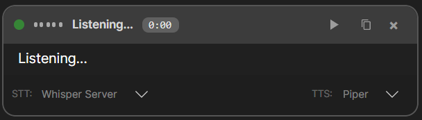
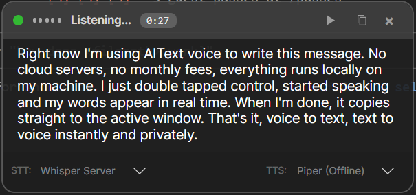
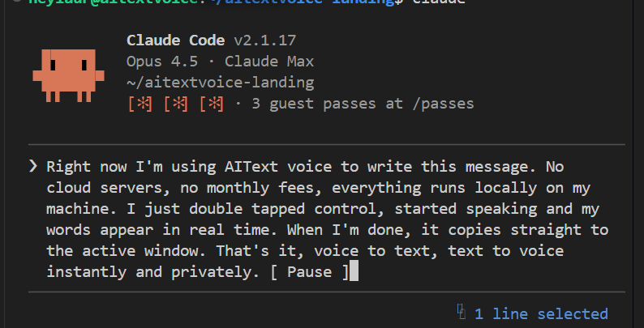
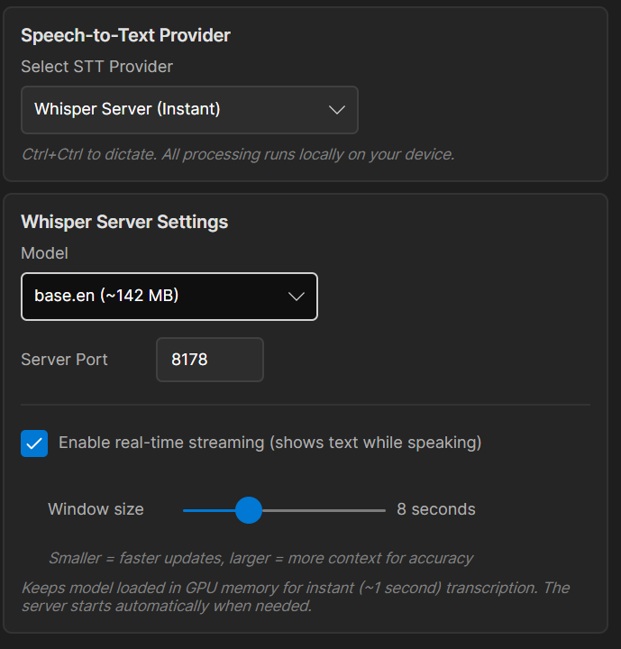

# AITextVoice

A **cross-platform** AI-powered speech-to-text and text-to-speech application that runs entirely on your local machine. Press **Ctrl+Ctrl** (double-tap) for speech-to-text or **Shift+Shift** for text-to-speech.

## Demo

https://github.com/blockchainadvisors/aitextvoice-releases/raw/main/docs/screenshots/demo.mp4

## Features

- **100% Local Processing**: All speech recognition and text-to-speech runs on your machine - no data sent to the cloud
- **Privacy-First**: Your voice and text never leave your device
- **Cross-Platform**: Runs on Windows, macOS, and Linux
- **Multilingual**: Supports 99+ languages for speech recognition
- **Speech-to-Text (STT)**: Local AI-powered transcription using whisper.cpp
- **Text-to-Speech (TTS)**: Read clipboard text aloud with local Piper voices
- **NVIDIA GPU Acceleration**: Optional CUDA support for faster transcription on NVIDIA GPUs
- **Floating Overlay**: Semi-transparent overlay window showing real-time transcription
- **Global Hotkeys**: Double-tap Ctrl for STT, double-tap Shift for TTS
- **System Tray**: Runs in background with status indicator
- **Auto-Clipboard**: Automatically copies transcribed text to clipboard
- **Insert at Cursor**: Optionally paste transcription directly into active application

## Downloads

> **[Download Latest Release](https://github.com/blockchainadvisors/aitextvoice-releases/releases/latest)**

| Platform | Architecture | Download |
|----------|--------------|----------|
| Windows | x64 | [AITextVoice-Setup.exe](https://github.com/blockchainadvisors/aitextvoice-releases/releases/latest) |
| macOS | Apple Silicon | [AITextVoice-macOS-arm64.dmg](https://github.com/blockchainadvisors/aitextvoice-releases/releases/latest) |
| macOS | Intel | [AITextVoice-macOS-x64.dmg](https://github.com/blockchainadvisors/aitextvoice-releases/releases/latest) |
| Linux | x64 | [AITextVoice-Linux-x64.AppImage](https://github.com/blockchainadvisors/aitextvoice-releases/releases/latest) |

## Installation

### Windows

1. Download `AITextVoice-Setup.exe` from the [Downloads](#downloads) section
2. Run the installer
3. **Windows SmartScreen**: If you see "Windows protected your PC", click **"More info"** then **"Run anyway"** (the app is not signed with a Windows certificate yet)
4. During installation, choose your whisper.cpp version:
   - **CPU (OpenBLAS)**: Works on all computers (~16 MB download)
   - **CUDA (GPU)**: Faster transcription for NVIDIA GPUs (~440 MB download)
5. The installer will download the speech recognition engine and model (~150 MB)

### macOS

1. Download the DMG file for your Mac (Apple Silicon or Intel)
2. Open the DMG and drag AITextVoice to Applications
3. On first launch, macOS may block the app - go to **System Preferences > Security & Privacy > General** and click **"Open Anyway"**
4. Grant **Accessibility** permission: System Preferences > Security & Privacy > Privacy > Accessibility

### Linux

1. Download the AppImage file
2. Make it executable: `chmod +x AITextVoice-*.AppImage`
3. Run: `./AITextVoice-*.AppImage`

**Note**: Requires X11 desktop environment. Wayland support is limited.

## Usage

### Speech-to-Text

1. **Press Ctrl+Ctrl** (double-tap Ctrl) - Start listening
2. **Speak** - Your words appear in real-time in the overlay
3. **Press Ctrl+Ctrl again** - Stop listening and copy text to clipboard

### Text-to-Speech

1. **Copy text** to your clipboard
2. **Press Shift+Shift** (double-tap Shift) - Start reading aloud
3. **Press Shift+Shift again** - Stop reading

### System Tray

The tray icon indicates current state:
- **Gray**: Ready
- **Gray + Red dot**: Update available
- **Green**: Listening
- **Orange**: Processing
- **Red**: Error

**Right-click** the tray icon for options: Settings, Check for Updates, Exit

## Settings

Access settings via **right-click tray icon → Settings**.

### STT Tab
- **Language**: Select from 99+ supported languages
- **Whisper Model**: Choose model size (base, small, medium, large)
- **Server Type**: Shows CPU or CUDA version installed
- **CUDA Upgrade**: Download GPU-accelerated version (if NVIDIA GPU detected)

### TTS Tab
- **Voice**: Select from available Piper voices
- **Speed/Pitch**: Adjust voice characteristics

### General Tab
- **Hotkeys**: Customize activation keys
- **Auto-start**: Launch on system startup
- **Overlay**: Configure appearance

## Requirements

- **Windows**: Windows 10/11 (x64)
- **macOS**: macOS 10.15+ (Catalina or later)
- **Linux**: X11 desktop environment
- **Microphone**: Required for speech-to-text
- **Disk Space**: ~500 MB (including speech models)
- **Optional**: NVIDIA GPU with CUDA for faster transcription

## Tech Stack

- **UI Framework**: [Avalonia UI](https://avaloniaui.net/) (cross-platform .NET)
- **Speech Recognition**: [whisper.cpp](https://github.com/ggerganov/whisper.cpp) (local)
- **Text-to-Speech**: [Piper](https://github.com/rhasspy/piper) (local)
- **Keyboard Hooks**: [SharpHook](https://github.com/TolikPyl662/SharpHook)
- **Audio**: [NAudio](https://github.com/naudio/NAudio) (Windows)

## Troubleshooting

### Windows SmartScreen Warning

The installer may show "Windows protected your PC" because the app isn't signed with a Windows code signing certificate. Click **"More info"** then **"Run anyway"** to proceed. The app is safe to use.

### Speech recognition not working

1. Ensure microphone is set as default recording device
2. Check that the whisper server downloaded successfully (Settings > STT)
3. Try downloading a different model size
4. For NVIDIA users: try the CUDA version for better performance

### Hotkey not responding

1. Adjust double-tap interval in Settings (default: 400ms)
2. **macOS**: Ensure Accessibility permission is granted
3. **Linux**: Ensure you're running on X11 (not Wayland)

### macOS Permissions

If hotkeys don't work:
1. Open **System Preferences > Security & Privacy > Privacy**
2. Select **Accessibility**
3. Add AITextVoice and enable it

## Privacy

AITextVoice is designed with privacy in mind:
- **No cloud services**: All processing happens locally on your device
- **No data collection**: We don't collect any usage data or analytics
- **No API keys required**: Everything works offline
- **Open source models**: Uses whisper.cpp and Piper, both open source

## License

This project is proprietary software. All rights reserved.

## Support

For issues and feature requests, please visit our [releases page](https://github.com/blockchainadvisors/aitextvoice-releases/releases).
